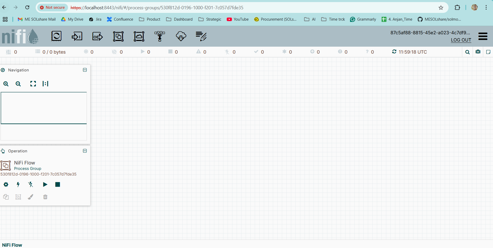
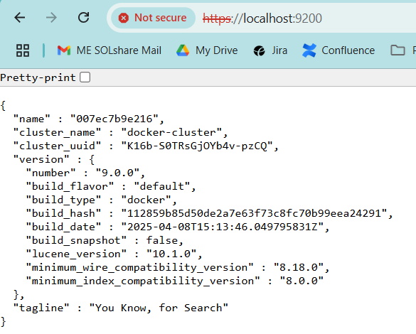
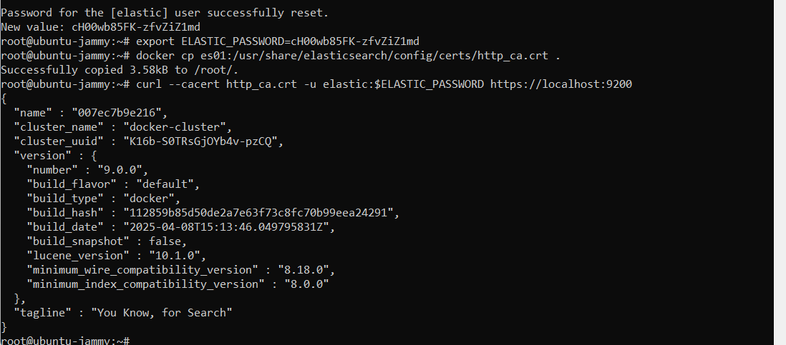
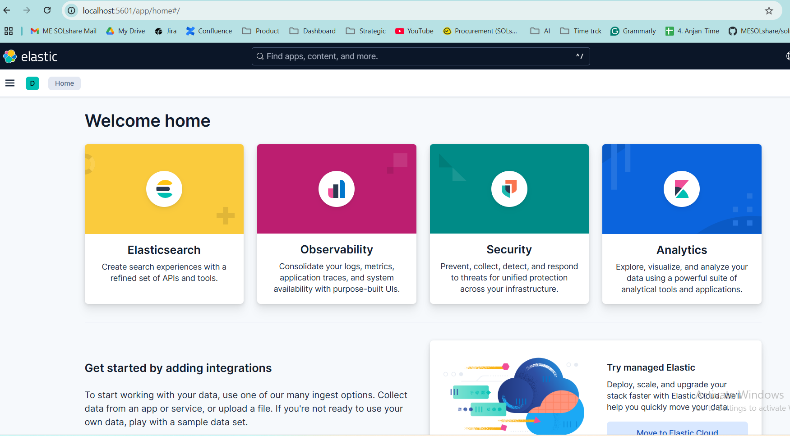
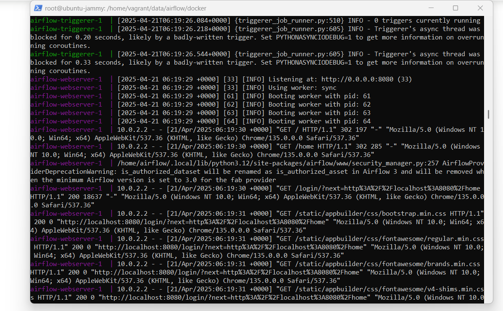
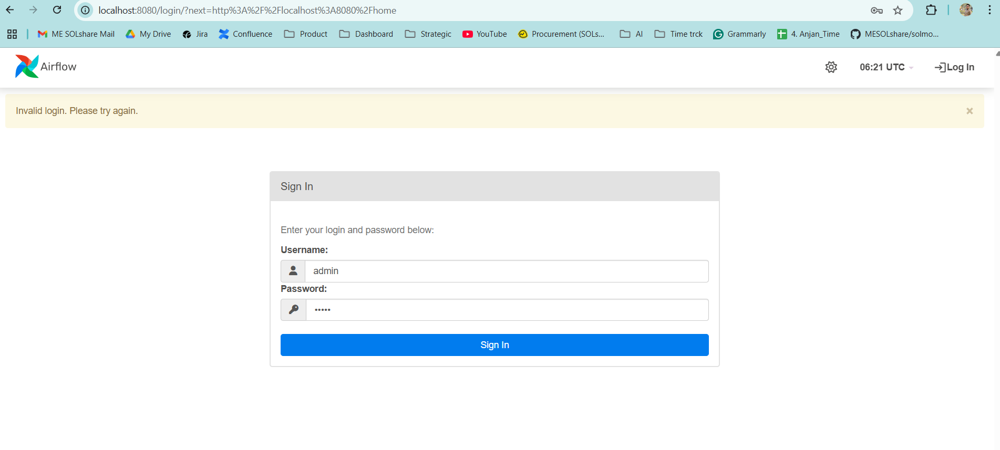
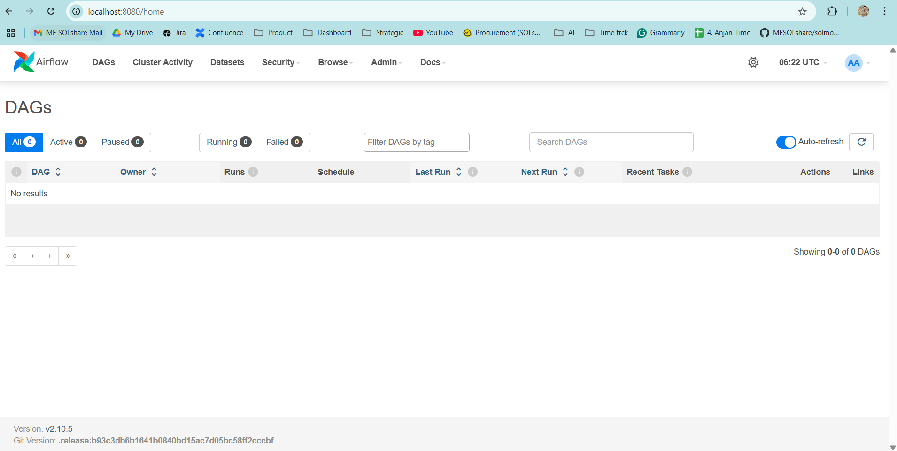
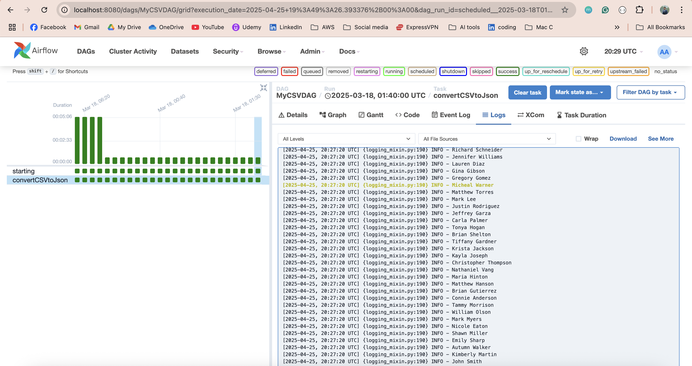

# DataPipeline
Under this repo, there will be an ELT pattern with AWS Redshift, Terraform to create infrastructure 

To capture a screenshot and copy it directly to the clipboard on a Mac, use the following keyboard shortcuts: press Command + Control + Shift + 3 for the full screen or Command + Control + Shift + 4 for a specific area. Then, you can paste the screenshot into any application using Command + V. 

### Docker Enable through bash script
    docker --version
    Docker version 28.1.1, build 4eba377
    docker-compose --version
    Docker Compose version v2.35.1

### SSH into your guest VM:
    vagrant ssh
    sudo -i

    [mount folder from host OS]
    sudo mkdir -p /home/vagrant/data 
    sudo mount -t vboxsf -v -o uid=1000,gid=1000 data /home/vagrant/data

    cd /home/vagrant/data
    docker-compose up --build

### Test Services

    Apache NiFi: https://localhost:8443/nifi/

    Apache Airflow: http://localhost:8080/health

    Kibana: http://localhost:5601

    Elasticsearch: https://localhost:9200

### Python version
    python3 --version
    Python 3.10.12  

    Poetry to manage packages
    pip install poetry
    poetry init  # creates pyproject.toml

    Creating virtualenv datapipeline-DCMZKO1j-py3.10 in /Users/anjandebnath/Library/Caches/pypoetry/virtualenvs
    poetry run python loadCSV.py
    
    
### Java version
[Ubuntu] https://www.theserverside.com/blog/Coffee-Talk-Java-News-Stories-and-Opinions/How-do-I-install-Java-on-Ubuntu

    sudo apt-get update
    sudo apt install default-jdk
    java -version
    update-alternatives --config java
    sudo nano /etc/environment
        JAVA_HOME="/usr/lib/jvm/java-11-openjdk-amd64/bin/java"
    source /etc/environment
    echo $JAVA_HOME

    openjdk version "11.0.26" 2025-01-21

[Mac] https://www.geeksforgeeks.org/how-to-install-openjdk-in-macos/

    echo $JAVA_HOME
    /opt/homebrew/opt/openjdk/libexec/openjdk.jdk/Contents/Home

### install Apache Nifi Docker
1. https://hub.docker.com/r/apache/nifi
  
   
   `docker run --name nifi \
  -p 8443:8443 \
  -d \
  apache/nifi:latest`

   docker logs nifi and find the 

   `Generated Username [USERNAME]
   Generated Password [PASSWORD]`

   https://localhost:8443/nifi/
   

2. https://www.youtube.com/watch?v=2hrUseUfCbc

### install Elasticsearch Docker Compose 
https://www.elastic.co/docs/deploy-manage/deploy/self-managed/install-elasticsearch-docker-compose

##### Elasticsearch
docker run --name es01 \
  --net elastic \
  -p 9200:9200 -p 9300:9300 \
  -e "discovery.type=single-node" \
  -e "ES_JAVA_OPTS=-Xms1g -Xmx1g" \
  --ulimit memlock=-1:-1 \
  --ulimit nofile=65536:65536 \
  docker.elastic.co/elasticsearch/elasticsearch:9.0.0

if the log prints 
"Cluster health status changed from [YELLOW] to [GREEN] (reason: [shards started ..."
✅ Elasticsearch started successfully and is now in a healthy state (GREEN). 🎉

`Fetch password: docker exec -it es01 /usr/share/elasticsearch/bin/elasticsearch-reset-password -u elastic `

##### Kibana
    When Kibana starts, it outputs a unique generated link to the terminal. To access Kibana, open this link in a web browser.
    Go to http://0.0.0.0:5601/?code=215541 to get started.

    Use the same username & password for elastic 
    Password for the [elastic] user successfully reset.
    New value: cH00wb85FK-zfvZiZ1md

CONTAINER ID   IMAGE                                                 COMMAND                  CREATED             STATUS                        PORTS     NAMES
00311a74acb2   docker.elastic.co/kibana/kibana:9.0.0                 "/bin/tini -- /usr/l…"   17 minutes ago      Exited (0) 37 seconds ago               kib01
007ec7b9e216   docker.elastic.co/elasticsearch/elasticsearch:9.0.0   "/bin/tini -- /usr/l…"   About an hour ago   Exited (143) 10 seconds ago             es01

### install Apache Airflow Docker Compose 
1. https://airflow.apache.org/docs/apache-airflow/stable/howto/docker-compose/index.html
2. https://airflow.atwish.org/installation/docker/
3. https://www.youtube.com/watch?v=AQuYwu2WolQ

`/home/vagrant/data/airflow/docker# docker compose up airflow-init`
`/home/vagrant/data/airflow/docker#docker compose up`

if successfull everything http://localhost:8080/

#### Run the DAG
1. Copy the CSV file to the worker container 
docker cp /Users/anjandebnath/Documents/DataPipeline/data.csv docker-airflow-worker-1:/home/airflow/data.csv
Successfully copied 93.7kB to docker-airflow-worker-1:/home/airflow/data.csv
2. Since there is a dependency on Pandas library so run 
docker exec -it docker-airflow-scheduler-1 bash
pip install pandas
docker exec -it docker-airflow-worker-1 bash
pip install pandas
Under airflow dags folder the python file will be mounted automatically
3. Trigger the DAG: default@8cf9e3243463:/opt/airflow$ airflow dags trigger MyCSVDAG
4. If success Congratulations! You have built a data pipeline with Python and ran it in
Airflow. 
